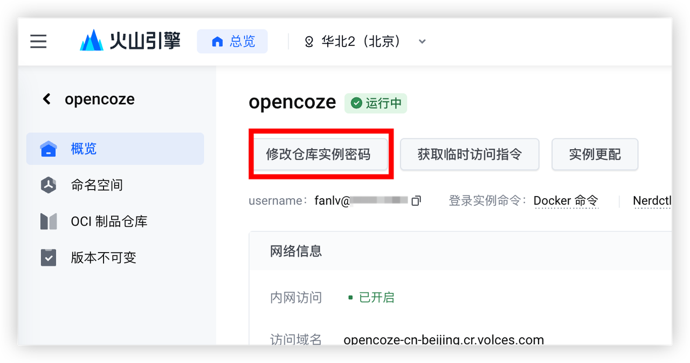
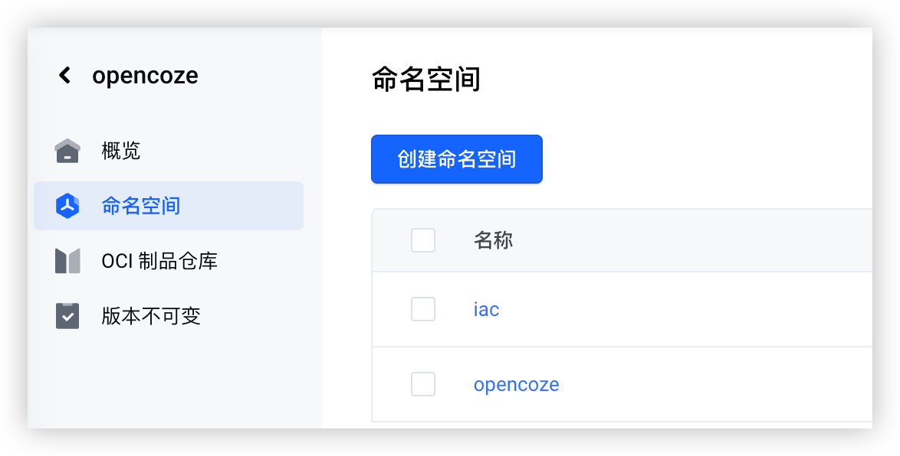
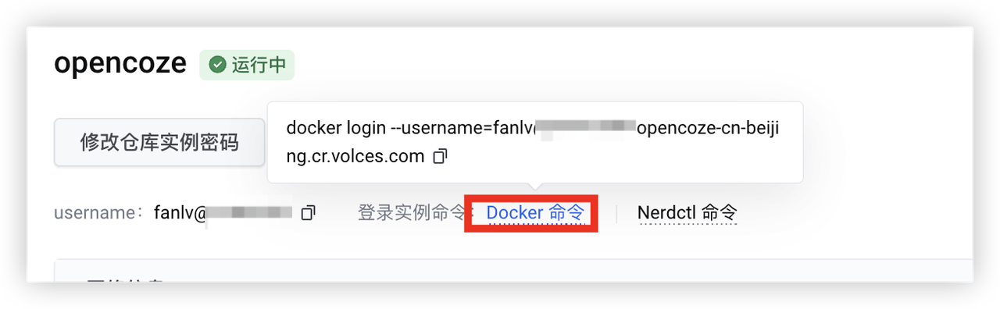
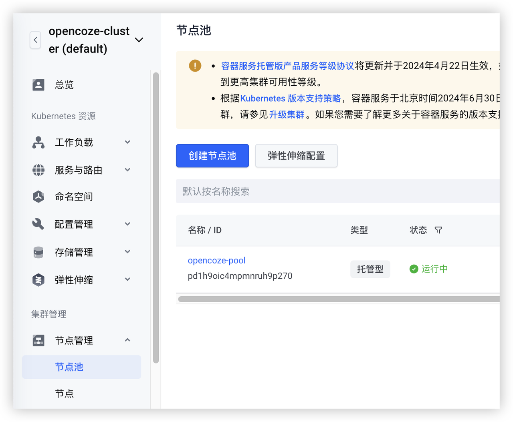
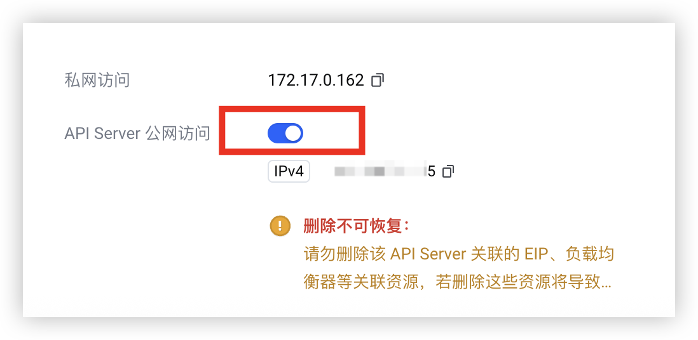
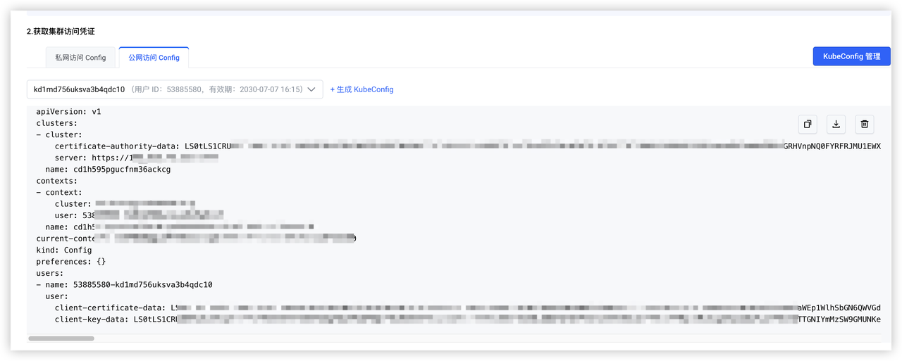
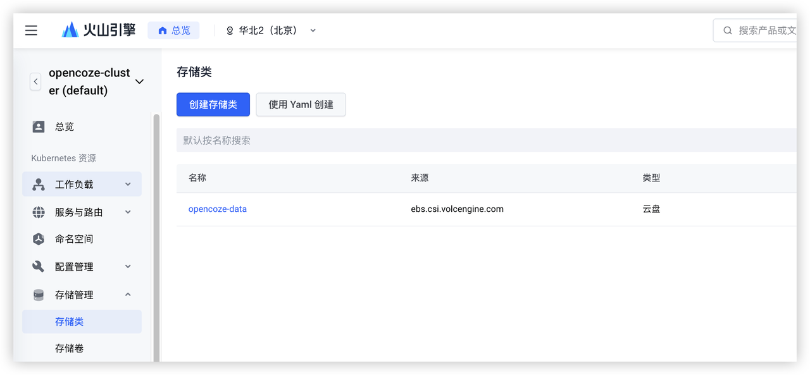
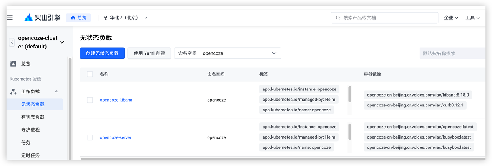
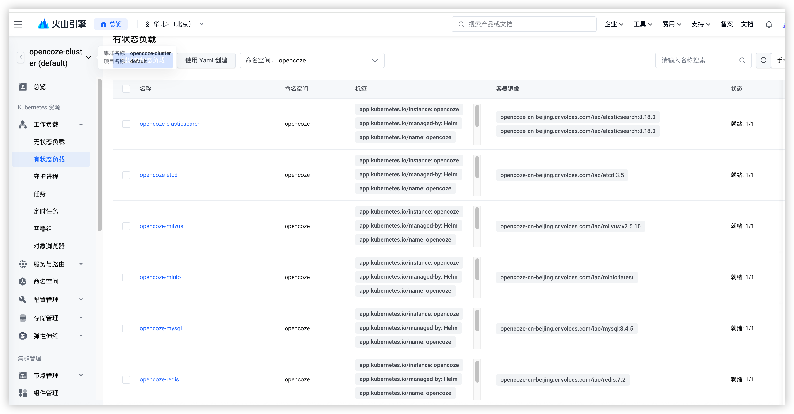

# OpenCoze 部署手册

## Local/VM (Docker Compose)

### 环境准备

| **项目** | **说明** |
| --- | --- |
| CPU | 8 Core |
| RAM | 16 GiB |
| Go  | * 已安装 Go，且版本为 1.24.2 及以上版本。  <br> * 配置 GOPATH，同时将 `${GOPATH}/bin` 加入到环境变量 PATH 中，保证安装的二进制工具可找到并运行。  |
| Docker  | 提前安装 Docker、Docker Compose，并启动 Docker 服务，详细操作请参考 Docker 文档：  <br>  <br> * **macOS**：推荐使用 Docker Desktop 安装，参考 [Docker Desktop For Mac](https://docs.docker.com/desktop/setup/install/mac-install/) 安装指南。  <br> * **Linux**：参考 [Docker 安装指南](https://docs.docker.com/engine/install/) 和 [Docker Compose](https://docs.docker.com/compose/install/) 安装指南。  <br> * **Windows**：推荐使用 Docker Desktop 安装，参考 [Docker Desktop For Windows](https://docs.docker.com/desktop/setup/install/windows-install/) 安装指南。  |

```shell
# 验证安装
docker compose version
```

### 部署步骤

1. **获取代码**

	```shell
	git clone https://github.com/coze-dev/coze-studio.git
	```

2. **配置模型**  
   进入目录 `coze-studio/backend/conf/model/meta`  
   修改 `doubao.yaml`（或其他模型文件）：
   - `api_key`: 火山方舟 API Key（[获取指南](https://www.volcengine.com/docs/82379/1541594)）
   - `model`: 方舟模型 ID（[模型列表](https://www.volcengine.com/docs/82379/1330310)）

	```yaml
	id: 102
	name: Doubao-1.5-pro-32k
	icon_uri: doubao_v2.png
	...
	conn_config:
	  api_key: # 你的API Key
	  model: # 模型名称
	```

3. **启动服务**

	```bash
	cd coze-studio/docker
	cp .env.example .env
	docker compose --profile '*' up -d
	```

---

## 火山容器云部署（Helm）

### 环境准备

| **工具**   | **安装说明** |
|------------|--------------|
| **kubectl**| **macOS**：`brew install kubectl`<br>**Linux**：<br>`curl -LO "https://dl.k8s.io/release/$(curl -Ls https://dl.k8s.io/release/stable.txt)/bin/linux/amd64/kubectl"`<br>`chmod +x kubectl && sudo mv kubectl /usr/local/bin/`<br>**Windows**：`winget install -e --id Kubernetes.kubectl` |
| **Helm**   | **macOS**：`brew install helm`<br>**Linux**：下载[最新版本](https://github.com/helm/helm/releases)<br>`tar -zxvf helm-*.tar.gz && sudo mv linux-amd64/helm /usr/local/bin/`<br>**Windows**：下载并添加PATH |

```shell
# 验证安装
kubectl version --client
helm version
```

### 自动创建火山云基础组件（可选）
> ⚠️ 创建火山云组件可能产生云产品费用

1. **进入目录**

	```shell
	cd scripts/volcengine
	cp .volcengine.example.env .env 
	```
2. **设置API密钥**  

   创建[API访问密钥](https://console.volcengine.com/iam/keymanage)

	```bash
	export VE_AK="your_ak"
	export VE_SK="your_sk"
	```

3. **创建组件**

	```shell
	# ⚠️ 创建火山云组件可能产生云产品费用
	go run .
	
	# 输出示例：
	Output Env :
	# MySQL
	export MYSQL_DATABASE=opencoze
	export MYSQL_USER=coze
	export MYSQL_PASSWORD=Opencoze123
	export MYSQL_HOST=vedbm-*****.pri.mysql.vedb.ivolces.com
	export MYSQL_PORT=3306
	
	# Redis
	export REDIS_ADDR=redis-*****.redis.ivolces.com:6379
	
	# Elasticsearch
	export ES_VERSION=v7
	export ES_ADDR=http://elasticsearch-o-*****.escloud.ivolces.com:9200
	export ES_USERNAME=admin
	export ES_PASSWORD=**********
	
	# RocketMQ
	export RMQ_NAME_SERVER=http://rocketmq-*****.rocketmq.ivolces.com:9876
	export RMQ_ACCESS_KEY=Xbg8***************
	export RMQ_SECRET_KEY=smJLA***************
	```

### 镜像推送

1. **创建镜像服务**  
   
   在 [火山云镜像服务控制台](https://console.volcengine.com/cr/)，按需创建自己的镜像仓库规格。

2. **设置仓库密码**  
   

3. **创建命名空间**  
   
   * iac：存放 mysql、redis、elasticsearch 等组件的空间
   * opencoze：存储 coze 镜像的空间

4. **登录仓库**
   

	```shell
	docker login --username=xxx opencoze-cn-beijing.cr.volces.com
	```

5. **推送服务镜像**

	```shell
	cd ./backend
	docker buildx build \
	  --platform linux/amd64,linux/arm64 \
	  -t 你的仓库域名/opencoze/opencoze:0.0.1 \
	  -t 你的仓库域名/opencoze/opencoze:latest \
	  -f backend/Dockerfile \
	  --push .
	```

6. **推送依赖镜像（可选）**

	```shell
	cd ./helm/charts/opencoze
	# 编辑 push_imgaes_to_volcengine.sh 按需修改使用到的镜像
	./push_imgaes_to_volcengine.sh
	```

### Helm 部署

1. **创建K8S集群**  
	登录 [火山云VKE控制台](https://console.volcengine.com/vke) 创建 `K8S` 集群。

2. **创建节点池**  
   

3. **配置kubectl**
   
   
   
   
   复制集群`config`到 `~/.kube/config`

4. **创建存储类（可选）**
	* 如果使用了`MySQL`、`Redis`、`RocketMQ`、`Elasticsearch`等存储组件，则需要创建。
	* 名称建议：`opencoze-data`，使用其他名字需要修改 `helm/charts/opencoze/values.yaml`中`storageClassName`配置。
   
   
   

5. **修改Helm配置**  
   编辑 `helm/charts/opencoze/values.yaml`文件，按需配置自己需要部署的组件:
   
	```yaml
	cozeServer:
	    enabled: true
	...   
	  mysql:
	    enabled: true
	...
	  redis:
	    enabled: true
	...
	  rocketmq:
	    enabled: true
	...
	  elasticsearch:
	    enabled: true
	...
	  minio:
	    enabled: true
	... 
	  etcd:
	    enabled: true
	...
	  milvus:
	    enabled: true
	...
	  kibana:
	    enabled: true
	```

6. **启动服务**

	```shell
	cd ./helm/charts/opencoze
	helm upgrade --install opencoze . -n opencoze --create-namespace
	```

7. **查看状态**
	
	```shell
	kubectl get pods --namespace opencoze
	# 等待所有Pod状态变为Running
	# 输出
	NAME                               READY   STATUS      RESTARTS   AGE
	opencoze-elasticsearch-0           1/1     Running     0          4h28m
	opencoze-es-init-w6q5h             0/1     Completed   0          4h28m
	opencoze-etcd-0                    1/1     Running     0          4h28m
	opencoze-kibana-75775d5b94-jpk4h   1/1     Running     0          4h28m
	opencoze-milvus-0                  1/1     Running     0          4h28m
	opencoze-minio-0                   1/1     Running     0          4h28m
	opencoze-mysql-0                   1/1     Running     0          4h28m
	opencoze-mysql-init-2bhxq          0/1     Completed   0          28s
	opencoze-redis-0                   1/1     Running     0          4h28m
	opencoze-rocketmq-broker-0         1/1     Running     0          4h28m
	opencoze-rocketmq-namesrv-0        1/1     Running     0          4h28m
	opencoze-server-6b9f6b4d66-f2qzd   1/1     Running     0          4h28m
	```
	- 等`opencoze-server-* pod`状态变成`Running`以后，表示服务启动成功
   
   

8. **获取服务IP**
	
	```shell
	kubectl get service --namespace opencoze
	# 使用 opencoze-server 的 EXTERNAL-IP
	```
	- 通过 `opencoze-server` 的`EXTERNAL-IP:8888`访问`coze`服务

9. **其他配置（可选）**  

   - 端口`ACL/IP`白名单
   - 调整公网`IP`带宽（默认`1M`）
   - 修改`MINIO_ENDPOINT`
   - 手动上传 `docker/volumes/minio/default_icon` 和 `volumes/minio/official_plugin_icon`到 `minio` 服务。

10. **运维操作**

	```shell
	# 升级
	helm upgrade --install opencoze . -n opencoze --create-namespace
	
	# 回滚
	helm history opencoze -n opencoze
	helm rollback opencoze <VERSION>
	
	# 卸载
	helm uninstall opencoze -n opencoze

	# 删除所有数据
	kubectl delete ns opencoze
	```